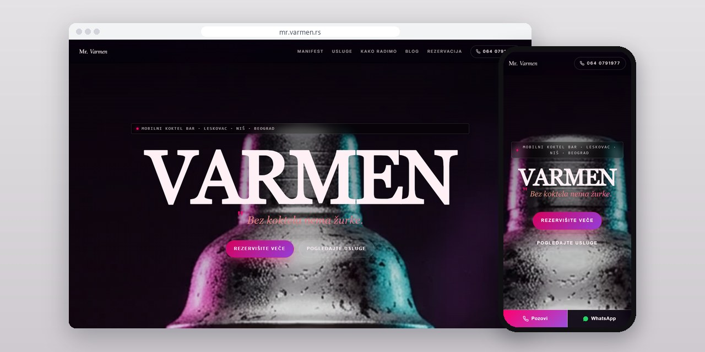
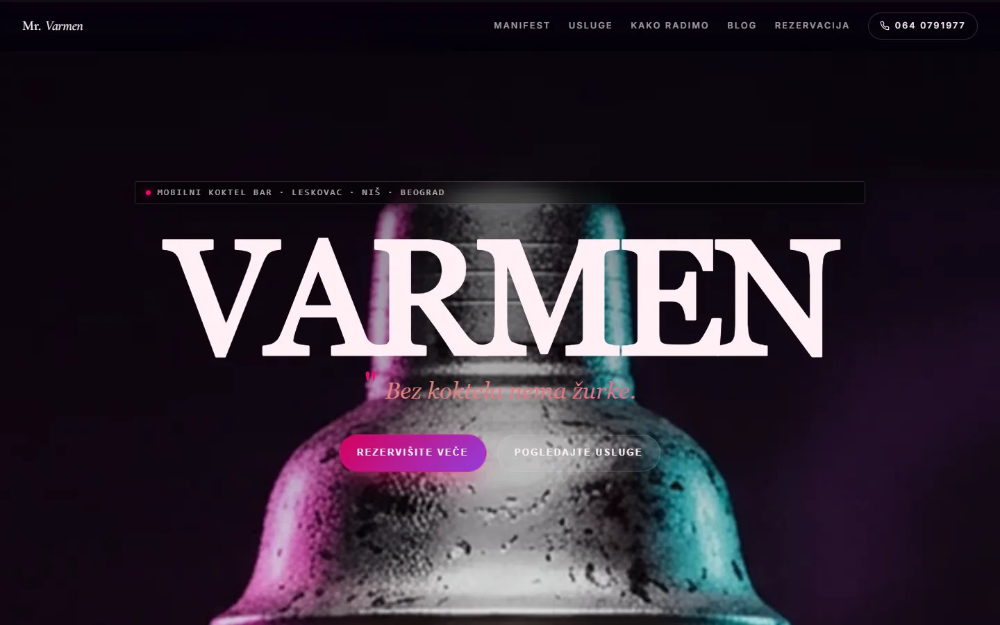
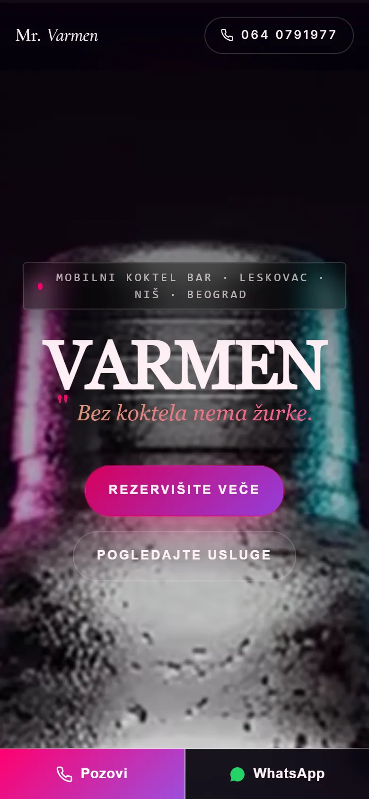
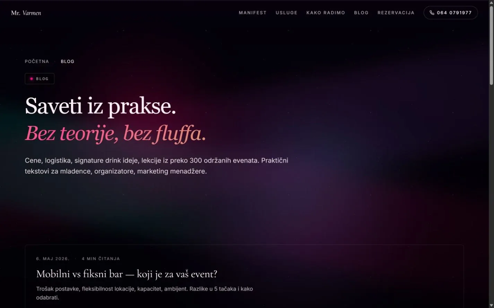

# Mr. Varmen

Site for a mobile cocktail bar that works weddings, birthdays and company events, opening with a film that plays as you scroll.

**[mr.varmen.rs](https://mr.varmen.rs/)** · [Case study (in Serbian)](https://svilenkovic.com/radovi/mr-varmen) · [Srpski](README.sr.md)

> [!NOTE]
> Client project. The source code belongs to the client and stays in a private repository. This page describes what I built and how.

<table>
  <tr><td><b>Client</b></td><td>Mr. Varmen</td></tr>
  <tr><td><b>Industry</b></td><td>Mobile cocktail bar for events</td></tr>
  <tr><td><b>Location</b></td><td>Leskovac, Niš and Belgrade, Serbia</td></tr>
  <tr><td><b>Type</b></td><td>Multi-page website</td></tr>
  <tr><td><b>My role</b></td><td>Design, development, SEO, hosting and maintenance</td></tr>
  <tr><td><b>Stack</b></td><td>Astro, JavaScript, PHP, JSON-LD</td></tr>
</table>

## About the project

Mr. Varmen brings a full cocktail bar and a bartender to weddings, birthdays and company events in Leskovac, Niš, Belgrade and the towns around them. People do not choose a mobile bar from a list of drinks, so the site first shows the preparation and the pour, and only then the offer. From there it leads to a short conversation about the date, the guest count and the menu.

The homepage opens with a pinned film in four chapters. On desktop the scroll position sets the video's playback time, on touch screens a separate mobile cut plays on a loop, and captions and a chapter rail follow the scroll either way. Nothing downloads until the first scroll or tap, or until six seconds have passed. With data saver on the video never loads, and visitors who ask for reduced motion get the poster and the text.

## What I built

- Separate pages for weddings, birthdays, company events and the Niš area, plus a blog with five practical posts
- A three-step booking flow (conversation, menu proposal, the evening) and a form for date, guest count, event type and location
- A small PHP endpoint behind the form, with spam protection and a clear confirmation for the visitor
- The pinned layout set by an inline script before the first paint, so the intro does not jump while the page loads
- An animation loop that runs only while the film is on screen, tracked with an IntersectionObserver
- Static pages from Astro, with the legal pages and cookie settings styled like the rest of the site

## Results

| | Performance | Accessibility | Best practices | SEO |
| :-- | :-: | :-: | :-: | :-: |
| Mobile | 98 | 100 | 100 | 100 |
| Desktop | 97 | 100 | 100 | 100 |

PageSpeed Insights, lab test of the live site, September 2026. Security headers: 6 of 6. HTML validator: no errors. axe accessibility check: no violations. Structured data: `FAQPage`, `LocalBusiness`, `Service`.

## Screenshots

<table>
  <tr>
    <td width="68%" valign="top"></td>
    <td width="32%" valign="top"></td>
  </tr>
</table>

The offer is split by event type and bar format

A blog with practical tips on choosing and organizing a bar

---

Built by [D. Svilenković](https://svilenkovic.com).
